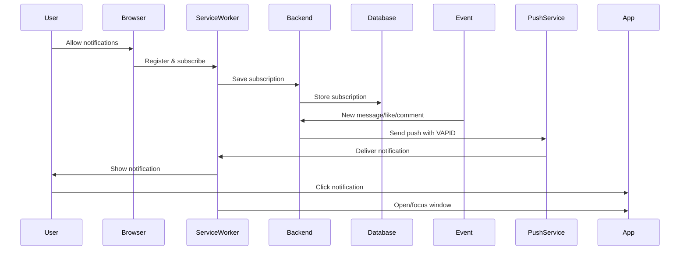

# 🔔 Push Notifications - Complete Guide

## 📋 Overview

Production-ready push notification system for Edupreneurs with support for Chrome, Edge, Safari (macOS & iOS), and all Chromium browsers.

### ✅ Features

- ✅ Background push notifications (even when site is closed)
- ✅ Works on Chrome, Edge, Safari (macOS 16+, iOS 16.4+ PWA)
- ✅ Multiple notification types (messages, comments, likes, posts, mentions)
- ✅ Notification actions (Open, Mark as read)
- ✅ PWA support for iOS
- ✅ VAPID authentication (no FCM required)
- ✅ Automatic subscription management
- ✅ Debug panel at `/dev/push`
- ✅ Comprehensive error handling

---

## 🚀 Quick Start

### 1. Enable Notifications

Visit `/community` and allow notifications when prompted, or visit `/dev/push` for manual setup.

### 2. Test Notifications

Go to `/dev/push` and click the test buttons to verify notifications work.

### 3. Integration

Notifications are automatically sent when:
- Someone sends you a direct message
- Someone comments on your post
- Someone likes your content
- Someone you follow creates a new post
- Someone mentions you

---

## 🏗️ Architecture

### Components

```
Frontend:
├── public/sw.js                          # Service Worker (push handler)
├── public/manifest.webmanifest           # PWA manifest
├── src/utils/pushNotifications.ts        # Push subscription logic
├── src/components/NotificationPermissionBanner.tsx
└── src/pages/DevPush.tsx                 # Debug panel

Backend:
├── supabase/functions/send-push-notification/
│   └── index.ts                          # Edge function for sending push
└── Database:
    └── push_subscriptions                # User subscriptions table
```

### Flow



---

## 🔧 Technical Details

### VAPID Keys

Current keys are hardcoded for development. For production, generate new keys:

```bash
# Using web-push (Node.js)
npx web-push generate-vapid-keys

# Or using openssl
openssl ecparam -name prime256v1 -genkey -noout -out vapid_private.pem
openssl ec -in vapid_private.pem -pubout -out vapid_public.pem
```

Update keys in:
- `supabase/functions/send-push-notification/index.ts` (lines 18-19)
- `src/utils/pushNotifications.ts` (line 59)
- `src/pages/DevPush.tsx` (line 166)

### Browser Support

| Browser | Version | Status | Notes |
|---------|---------|--------|-------|
| Chrome | Latest | ✅ Full | Native Push API |
| Edge | Latest | ✅ Full | Native Push API |
| Safari macOS | 16+ | ✅ Full | Native Push API |
| Safari iOS/iPadOS | 16.4+ | ✅ PWA only | Requires app installation |
| Firefox | Latest | ✅ Full | Native Push API |

### iOS Safari Requirements

For iOS Safari, push notifications require:
1. PWA installed (Add to Home Screen)
2. Permissions granted in iOS Settings > [App Name] > Notifications
3. App opened at least once

### Notification Payload Spec

```typescript
{
  "type": "message" | "comment" | "like" | "post" | "mention",
  "title": string,
  "body": string,
  "icon": string (default: "/logo.png"),
  "badge": string (default: "/logo.png"),
  "tag": string (for deduplication),
  "renotify": boolean,
  "data": {
    "deeplink": string (e.g., "/community?conversation=123"),
    "conversationId": string?,
    "postId": string?,
    "senderId": string?,
    "category": string
  },
  "actions": [
    {"action": "open", "title": "Ouvrir"},
    {"action": "mark_read", "title": "Marquer comme lu"}
  ]
}
```

---

## 🧪 Testing

### Debug Panel (`/dev/push`)

Features:
- ✅ Check permission status
- ✅ Register service worker
- ✅ Subscribe/unsubscribe
- ✅ Send test notifications (all types)
- ✅ View subscription JSON
- ✅ Real-time logs
- ✅ Error tracking

### Test Checklist

1. **Basic Setup**
   ```
   [ ] Navigate to /dev/push
   [ ] Click "Check Permission" - should show "default"
   [ ] Click "Register SW" - should show "active"
   [ ] Click "Subscribe" - permission prompt appears
   [ ] Grant permission - subscription created
   ```

2. **Test Notifications**
   ```
   [ ] Click "Message" test - notification appears
   [ ] Close browser tab - notification still visible
   [ ] Click notification - opens /community
   [ ] Test other types (comment, like, post, mention)
   ```

3. **iOS Testing** (if applicable)
   ```
   [ ] Add to Home Screen
   [ ] Open PWA
   [ ] Enable notifications in Settings
   [ ] Test message notification
   [ ] Tap notification - app opens to correct page
   ```

### Manual Test via Console

```javascript
// Send test push
const { data, error } = await supabase.functions.invoke('send-push-notification', {
  body: {
    recipientUserId: 'USER_ID_HERE',
    title: 'Test Title',
    body: 'Test Body',
    conversationId: null
  }
});
console.log(data, error);
```

---

## 🔌 Integration Guide

### Sending Notifications

```typescript
import { supabase } from "@/integrations/supabase/client";

// Send a notification
const sendNotification = async (userId: string, type: string, data: any) => {
  const { data: result, error } = await supabase.functions.invoke('send-push-notification', {
    body: {
      recipientUserId: userId,
      title: getTitle(type, data),
      body: getBody(type, data),
      conversationId: data.conversationId || null
    }
  });

  if (error) {
    console.error('Failed to send push:', error);
  } else {
    console.log('Push sent:', result);
  }
};
```

### Event Hooks

Add to your message/comment/like handlers:

```typescript
// After creating a message
await sendNotification(recipientId, 'message', {
  conversationId: conversation.id,
  senderName: currentUser.name
});

// After creating a comment
await sendNotification(postOwnerId, 'comment', {
  postId: post.id,
  commenterName: currentUser.name
});
```

---

## 🐛 Troubleshooting

### Common Issues

#### 1. "Notification permission denied"
- **Cause**: User clicked "Block" or has notifications disabled
- **Fix**: Clear site data or check browser settings > Notifications

#### 2. "Service Worker not registered"
- **Cause**: HTTPS required (except localhost)
- **Fix**: Ensure using HTTPS or localhost

#### 3. "Push notification failed with 401"
- **Cause**: Invalid VAPID signature
- **Fix**: Check VAPID keys match between frontend and backend

#### 4. "No subscription found"
- **Cause**: User hasn't subscribed or subscription expired
- **Fix**: Re-subscribe via `/dev/push` or banner prompt

#### 5. iOS: "Notifications not working"
- **Cause**: App not installed as PWA or permissions not granted
- **Fix**: Add to Home Screen, check iOS Settings > [App] > Notifications

### Debug Steps

1. Open `/dev/push`
2. Check all status indicators (green = good)
3. Review logs for errors
4. Test each notification type
5. Check browser console for SW errors
6. Verify VAPID keys match everywhere

### Browser Console Commands

```javascript
// Check permission
console.log('Permission:', Notification.permission);

// Check SW registration
navigator.serviceWorker.getRegistration().then(reg => {
  console.log('SW registered:', !!reg);
  console.log('SW active:', !!reg?.active);
});

// Check subscription
navigator.serviceWorker.ready.then(reg => {
  reg.pushManager.getSubscription().then(sub => {
    console.log('Subscription:', sub ? 'Active' : 'None');
    if (sub) console.log(JSON.stringify(sub.toJSON(), null, 2));
  });
});

// Manual notification test
new Notification('Test', { body: 'Manual test' });
```

---

## 📊 Monitoring

### Edge Function Logs

View in Supabase Dashboard or via CLI:

```bash
supabase functions logs send-push-notification --tail
```

### Database Queries

```sql
-- Check subscriptions
SELECT 
  user_id, 
  created_at, 
  updated_at,
  subscription->>'endpoint' as endpoint
FROM push_subscriptions;

-- Count active subscriptions
SELECT COUNT(*) FROM push_subscriptions;

-- Find users without subscriptions
SELECT u.id, u.email 
FROM auth.users u
LEFT JOIN push_subscriptions ps ON u.id = ps.user_id
WHERE ps.id IS NULL;
```

---

## 🔒 Security

### Best Practices

- ✅ VAPID keys secured (not exposed to client beyond public key)
- ✅ HTTPS only
- ✅ User authentication required for subscription
- ✅ RLS policies on push_subscriptions table
- ✅ Payload size limits (< 4KB)
- ✅ Rate limiting (handled by browser)
- ✅ Expired subscription cleanup (404/410 responses)

### RLS Policies

```sql
-- Users can only manage their own subscriptions
CREATE POLICY "Users manage own subscriptions" ON push_subscriptions
FOR ALL USING (auth.uid() = user_id);
```

---

## 📱 PWA Installation

### iOS/iPadOS

1. Open Safari
2. Tap Share button
3. Tap "Add to Home Screen"
4. Open app from home screen
5. Grant notification permission

### Android

1. Open Chrome/Edge
2. Tap three dots menu
3. Tap "Install app" or "Add to Home Screen"
4. Open app
5. Grant notification permission

---

## 🎯 Future Enhancements

Possible improvements:
- [ ] Per-category notification preferences
- [ ] Quiet hours
- [ ] Notification sound customization
- [ ] Rich media in notifications (images, videos)
- [ ] Reply from notification
- [ ] Notification history
- [ ] Analytics dashboard

---

## 📚 Resources

- [Web Push Protocol](https://datatracker.ietf.org/doc/html/rfc8030)
- [Push API MDN](https://developer.mozilla.org/en-US/docs/Web/API/Push_API)
- [Service Worker API](https://developer.mozilla.org/en-US/docs/Web/API/Service_Worker_API)
- [VAPID Specification](https://datatracker.ietf.org/doc/html/rfc8292)
- [Safari Push Notifications](https://webkit.org/blog/12945/meet-web-push/)

---

## 🆘 Support

Issues? Check:
1. `/dev/push` debug panel
2. Browser console for errors
3. Edge function logs
4. This documentation

Still stuck? Open an issue with:
- Browser and version
- Error messages from console/logs
- Steps to reproduce
- Screenshots if relevant
